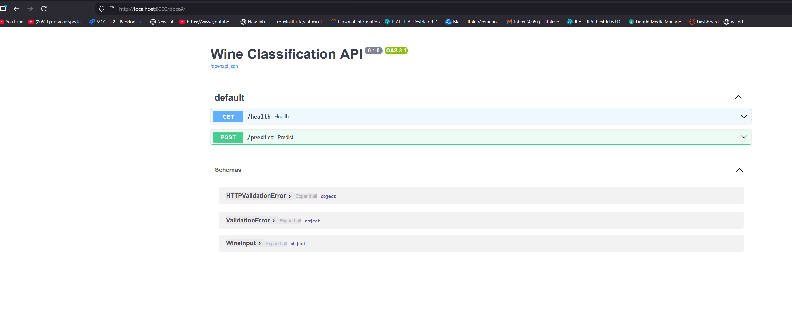
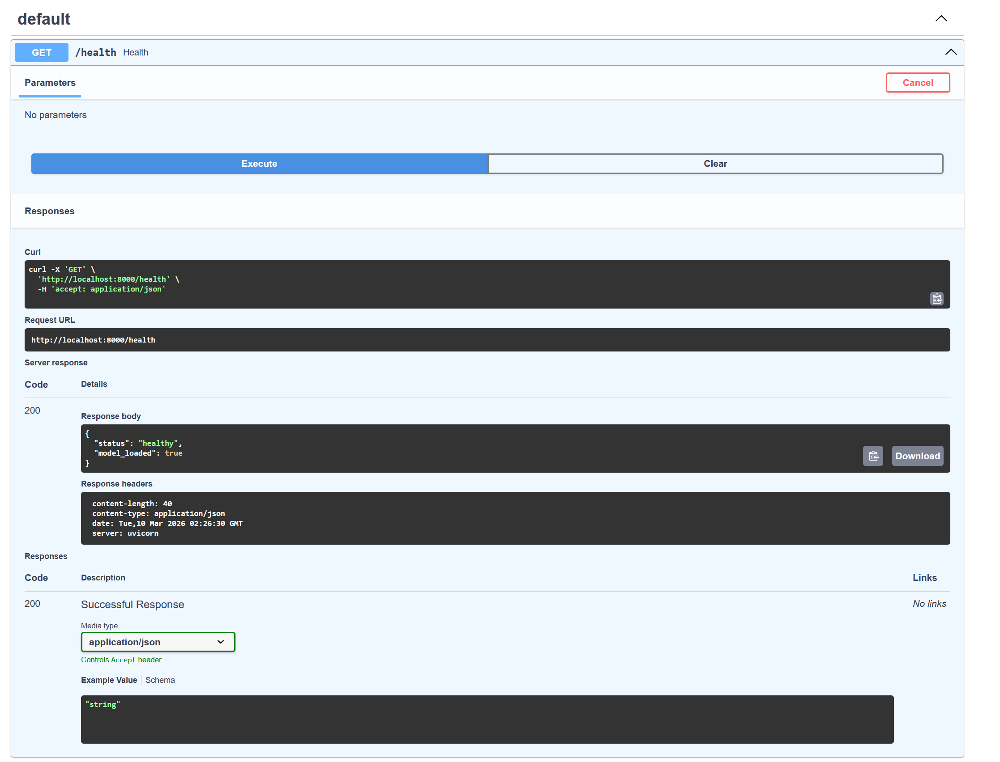
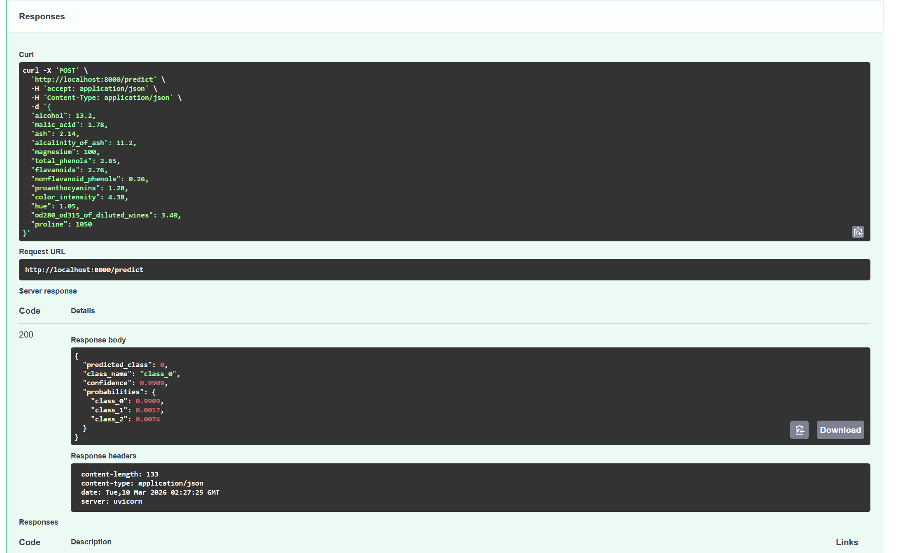
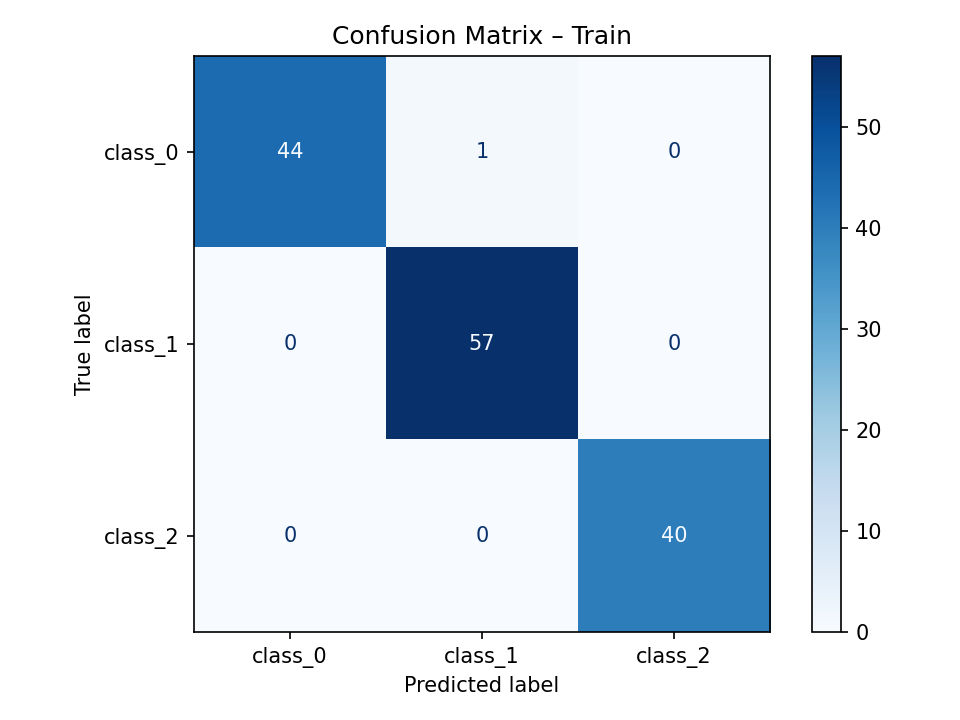
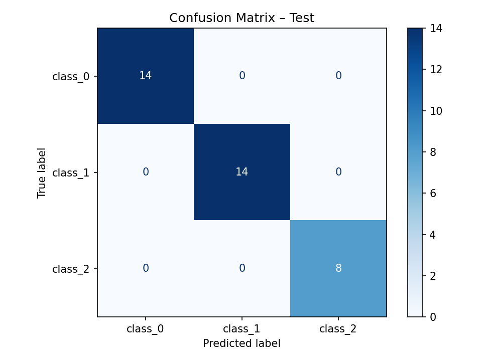

# Lab 4 – Dockerized Wine Classification API

## Changes

1. Changed the dataset to the Wine dataset
2. Changed the model to Logistic Regression
3. Added a FastAPI server with `/health` and `/predict` endpoints
4. The `/predict` endpoint returns the predicted class, a confidence score, and per-class probabilities
5. Training now saves confusion matrices (train and test) and classification scores to a `model_metrics/` folder

## Run Instructions

```bash
docker build -t wine-api .
docker run -d -p 8000:8000 --name wine-api wine-api
```

API at http://localhost:8000

Test:
```bash
curl http://localhost:8000/health
curl -X POST http://localhost:8000/predict -H "Content-Type: application/json" -d '{"alcohol":13,"malic_acid":2,"ash":2.3,"alcalinity_of_ash":15,"magnesium":100,"total_phenols":2.5,"flavanoids":2.5,"nonflavanoid_phenols":0.3,"proanthocyanins":1.5,"color_intensity":5,"hue":1,"od280_od315_of_diluted_wines":3,"proline":1000}'
```

Stop and remove:
```bash
docker stop wine-api
docker rm wine-api
```

## API Endpoints

`GET /health` — returns status and whether model is loaded

`POST /predict` — classify a wine sample

Request body:
```json
{
  "alcohol": 13.2,
  "malic_acid": 1.78,
  "ash": 2.14,
  "alcalinity_of_ash": 11.2,
  "magnesium": 100,
  "total_phenols": 2.65,
  "flavanoids": 2.76,
  "nonflavanoid_phenols": 0.26,
  "proanthocyanins": 1.28,
  "color_intensity": 4.38,
  "hue": 1.05,
  "od280_od315_of_diluted_wines": 3.40,
  "proline": 1050
}
```

Response:
```json
{
  "predicted_class": 0,
  "class_name": "class_0",
  "confidence": 0.9909,
  "probabilities": {
    "class_0": 0.9909,
    "class_1": 0.0017,
    "class_2": 0.0074
  }
}
```

Swagger UI is at `/docs`.







## Model Metrics

Training saves outputs to `model_metrics/` inside the container. Since these artifacts live inside Docker, we need to copy them out to the local repo:
```bash
docker cp wine-api:/app/model_metrics ./model_metrics
```
This copies the confusion matrices and scores JSON into the local `model_metrics/` folder.

Files saved:
- `scores.json` — accuracy, precision, recall, F1 for train and test sets
- `confusion_matrix_train.png` — confusion matrix on training data
- `confusion_matrix_test.png` — confusion matrix on test data

### Confusion Matrices





### Scores

```json
{
  "train": {
    "accuracy": 0.993,
    "precision": 0.9931,
    "recall": 0.993,
    "f1_score": 0.9929
  },
  "test": {
    "accuracy": 1.0,
    "precision": 1.0,
    "recall": 1.0,
    "f1_score": 1.0
  }
}
```