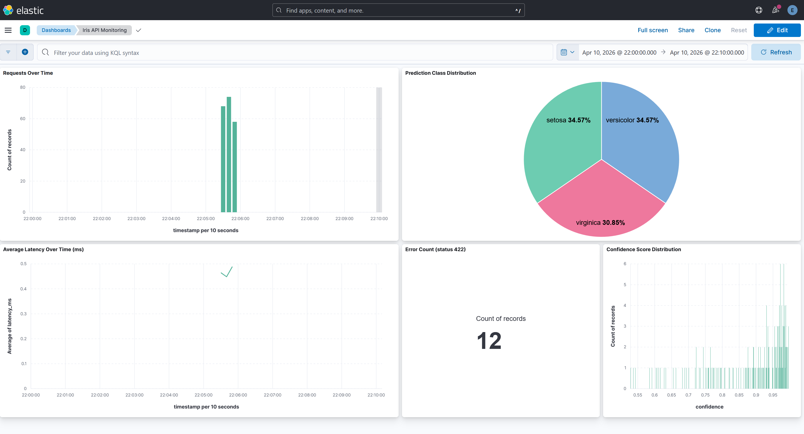

# ELK Lab — ML API Monitoring Pipeline

## Changes Made in This Lab

1. **Added a FastAPI server** (`api.py`) that serves an Iris classification model trained with scikit-learn's LogisticRegression. The server exposes two endpoints — `/health` for liveness checks and `/predict` for inference.

2. **Changed logs to JSON format** — API logs are written as structured JSON instead of plain text, making them easier to parse and query. Every request to `/predict` is logged as a single JSON line to `api.log`. Each log entry contains:
   ```json
   {
     "timestamp": "2026-04-10T22:04:01Z",
     "request_id": "uuid",
     "endpoint": "/predict",
     "status_code": 200,
     "latency_ms": 3.21,
     "prediction": "versicolor",
     "prediction_class": 1,
     "confidence": 0.8912,
     "sepal_length": 6.1,
     "sepal_width": 2.8,
     "petal_length": 4.7,
     "petal_width": 1.2,
     "prob_setosa": 0.0041,
     "prob_versicolor": 0.8912,
     "prob_virginica": 0.1047
   }
   ```

3. **Logstash pipeline** (`logstash.conf`) reads `api.log` line by line, parses each JSON entry, and ships it to Elasticsearch under the index `iris-api-YYYY.MM.dd`. It also tags error requests (status 422) for easy filtering.

4. **Traffic simulator** (`simulate_traffic.py`) sends 200 requests to the API — 95% valid Iris samples with added noise, 5% intentionally invalid requests to generate error logs.

5. **Kibana dashboard** (`create_kibana_dashboard.sh`) automatically creates a monitoring dashboard with 5 panels. Rather than clicking through the Kibana UI, we use the Kibana saved objects API to create all visualizations and the dashboard programmatically via `curl` calls:

   | Panel | Type | What it shows |
   |---|---|---|
   | Requests Over Time | Bar chart | Request volume bucketed by time |
   | Prediction Class Distribution | Pie chart | How often each class (setosa/versicolor/virginica) is predicted |
   | Average Latency Over Time | Line chart | API response time trend in ms |
   | Error Count | Metric | Total count of 422 error requests |
   | Confidence Score Distribution | Histogram | Distribution of model confidence scores |

---

## ELK Stack Installation

> For a video walkthrough see: [ELK installation on Windows WSL Ubuntu](https://www.youtube.com/watch?v=UMjDYQO2lo0)

### Download

Download the Linux tar.gz packages for version 8.12.2:

- **Elasticsearch**: https://www.elastic.co/downloads/elasticsearch
- **Kibana**: https://www.elastic.co/downloads/kibana
- **Logstash**: https://www.elastic.co/downloads/logstash
- **Java 21** (required by ES 8.12): https://www.oracle.com/java/technologies/downloads/

### Move files into WSL

The downloaded files will be in your Windows Downloads folder. Move them into the WSL home directory:

```bash
cd /mnt/c/Users/<username>/Downloads
sudo mv elasticsearch-8.12.2-linux-x86_64.tar.gz kibana-8.12.2-linux-x86_64.tar.gz logstash-8.12.2-linux-x86_64.tar.gz /home
```

### Extract

```bash
cd /home
sudo tar -xzvf elasticsearch-8.12.2-linux-x86_64.tar.gz
sudo tar -xzvf kibana-8.12.2-linux-x86_64.tar.gz
sudo tar -xzvf logstash-8.12.2-linux-x86_64.tar.gz
```

### Configure Java

Add Java to your PATH so Elasticsearch can find it:

```bash
nano ~/.bashrc
```

Add these two lines at the bottom, then save (`Ctrl+S`) and exit (`Ctrl+X`):

```bash
export JAVA_HOME=/home/jdk-21.0.2
export PATH=$JAVA_HOME/bin:$PATH
```

Reload the shell:

```bash
source ~/.bashrc
```

### Grant permissions

Give your user ownership of the extracted directories (replace `jithin` with your username):

```bash
sudo chown -R jithin:jithin /home/elasticsearch-8.12.2
sudo chown -R jithin:jithin /home/kibana-8.12.2
sudo chown -R jithin:jithin /home/logstash-8.12.2
```

### First-time Kibana setup

On first boot, Kibana needs to be linked to Elasticsearch using an enrollment token.

**1. Start Elasticsearch:**
```bash
/home/elasticsearch-8.12.2/bin/elasticsearch
```

**2. In a new terminal, generate the enrollment token:**
```bash
/home/elasticsearch-8.12.2/bin/elasticsearch-create-enrollment-token --scope kibana
```
Copy the token output.

**3. Reset the elastic user password:**
```bash
/home/elasticsearch-8.12.2/bin/elasticsearch-reset-password -u elastic
```
Note down the generated password.

**4. Start Kibana:**
```bash
/home/kibana-8.12.2/bin/kibana
```

Open http://localhost:5601 in your browser, paste the enrollment token when prompted, then log in with username `elastic` and the password from step 3.

---

## How to Run

### Prerequisites

- **WSL Ubuntu** running on Windows — all commands must be run inside a WSL Ubuntu terminal, not PowerShell or CMD. Open one by pressing `Win`, typing `Ubuntu`, and launching the app.
- **ELK Stack 8.12.2** installed in WSL at `/home/jithin/` — follow the installation section above if not done yet.
- **Python 3.12** available in WSL via `python3`.

---

### Step 1 — First-time Python environment setup

WSL Ubuntu does not ship with the `venv` module by default, so it needs to be installed before creating the environment. This only needs to be done once.

```bash
sudo apt install -y python3.12-venv
python3 -m venv /home/jithin/mlenv
```

This creates an isolated Python environment at `/home/jithin/mlenv/`. All packages (scikit-learn, FastAPI, uvicorn, etc.) are installed here, completely separate from any system Python or Anaconda installation. The `run_pipeline.sh` script installs all required packages automatically on each run.

---

### Step 2 — Start Elasticsearch

Open a WSL Ubuntu terminal and run:

```bash
/home/jithin/elasticsearch-8.12.2/bin/elasticsearch
```

Elasticsearch starts an HTTP server on port 9200. In version 8.x it uses HTTPS by default and requires authentication. Wait until you see a line containing `started` before proceeding. Keep this terminal open — closing it stops Elasticsearch.

---

### Step 3 — Start Kibana

Open a second WSL Ubuntu terminal and run:

```bash
/home/jithin/kibana-8.12.2/bin/kibana
```

Kibana connects to Elasticsearch and starts a web UI on port 5601. The first startup takes 2-3 minutes while it initialises its internal indices. Once ready, open http://localhost:5601 in your browser. Kibana is where you view the dashboard — it reads data from Elasticsearch and renders it as interactive visualizations.

---

### Step 4 — Run the pipeline

Open a third WSL Ubuntu terminal and run:

```bash
bash /mnt/c/Users/jithi/OneDrive/Desktop/MLops/MLOps/Labs/ELK_Labs/Lab1_Setup_Windows_WSL_Ubuntu/run_pipeline.sh
```

This single script automates the entire pipeline end to end:

1. **Install packages** — installs scikit-learn, FastAPI, uvicorn, requests, joblib and numpy into the venv
2. **Train model** — runs `train_model.py`, which fits a LogisticRegression classifier on the Iris dataset and saves it as `iris_model.pkl`
3. **Wait for Elasticsearch** — polls the ES health endpoint until it responds, so subsequent steps don't fail if ES is still booting
4. **Clear old data** — empties `api.log` and deletes any existing `iris-api-*` index in Elasticsearch, ensuring a clean run each time
5. **Start the API server** — launches `api.py` via uvicorn in the background on port 8000, loads the trained model, and waits until the `/health` endpoint responds
6. **Simulate traffic** — runs `simulate_traffic.py`, which sends 200 POST requests to `/predict`. 95% use real Iris samples with slight random noise; 5% use an invalid negative feature value to deliberately trigger 422 errors. All requests are logged to `api.log`.
7. **Run Logstash** — starts Logstash with `logstash.conf` in the background. Logstash reads `api.log` line by line, parses each JSON entry, converts the `timestamp` field into a proper date, and indexes each document into Elasticsearch under `iris-api-YYYY.MM.dd`. The script polls ES every 10 seconds and stops Logstash once 190+ documents are confirmed.
8. **Create Kibana data view** — registers the `iris-api-*` index pattern in Kibana so it can be queried in dashboards.

---

### Step 5 — Create the Kibana dashboard

After the pipeline finishes, run:

```bash
bash /mnt/c/Users/jithi/OneDrive/Desktop/MLops/MLOps/Labs/ELK_Labs/Lab1_Setup_Windows_WSL_Ubuntu/create_kibana_dashboard.sh
```

Instead of manually building charts in the Kibana UI, this script uses the Kibana saved objects API to programmatically create all 5 panels and assemble them into a dashboard called **"Iris API Monitoring"** — the same result, reproducible in seconds. It fetches the current data view ID automatically so it always wires up to the correct index.

Open http://localhost:5601/app/dashboards, find **"Iris API Monitoring"**, and set the time range to **Today** or **Last 24 hours** to see the data.

---

## Dashboard



*Screenshot of the Iris API Monitoring dashboard in Kibana showing all 5 panels.*

---

## File Reference

| File | Purpose |
|---|---|
| `train_model.py` | Trains LogisticRegression on Iris dataset, saves `iris_model.pkl` |
| `api.py` | FastAPI server — `/health` and `/predict` endpoints, logs each request as JSON |
| `simulate_traffic.py` | Sends 200 requests to the API (95% valid, 5% errors) |
| `logstash.conf` | Reads `api.log` → ships to Elasticsearch over HTTPS |
| `run_pipeline.sh` | End-to-end automation: install → train → API → traffic → Logstash → Kibana data view |
| `create_kibana_dashboard.sh` | Creates all 5 Kibana dashboard panels via saved objects API |
| `requirements.txt` | Python dependencies |


