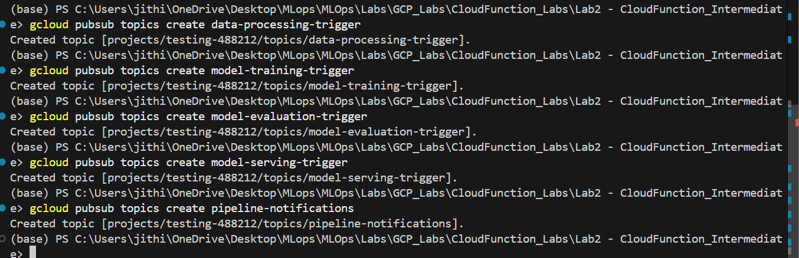

# Building a Serverless Machine Learning Pipeline with Google Cloud Functions

In this lab we will walk through the process of building a serverless machine learning pipeline using Google Cloud Functions, Pub/Sub, and Workflows and deploying individual functions for data processing, model training, model evaluation, and prediction, orchestrating them into a seamless pipeline.

---

## Changes Made in This Lab

- Added a new **Model Evaluation** function that loads the trained model from GCS, evaluates it on a held-out test set, and routes the pipeline based on whether accuracy meets the threshold
- Added a new **Notification** function that sends email alerts via SendGrid with the model's evaluation results — success or failure

---

## Deployment Screenshots

### Cloud Run Functions Deployed


### Pub/Sub Topics


### Email Alert from Model Evaluation


### Inference Example


---

## Prerequisites
- Google Cloud SDK installed
- PowerShell (Windows)
- Active GCP project with billing enabled
- All commands below use PowerShell syntax (backtick `` ` `` for line continuation)

---

## Step 1: Authenticate and Configure GCP

**Login to GCP:**
```powershell
gcloud auth login
```
This opens a browser — sign in with your Google account.

**Set your project:**
```powershell
gcloud config set project testing-488212
```

**Verify config:**
```powershell
gcloud config list
```

---

## Step 2: Enable Required APIs

```powershell
gcloud services enable cloudfunctions.googleapis.com pubsub.googleapis.com workflows.googleapis.com storage.googleapis.com monitoring.googleapis.com secretmanager.googleapis.com
```

---

## Step 3: Create a Cloud Storage Bucket

Create the bucket in `us-central1` to match the function region:

```powershell
gcloud storage buckets create gs://mlops-labs-jithin --location=us-central1
```

> **Note:** Make sure the bucket region matches the function region or you will get a trigger location mismatch error on deploy.

---

## Step 4: Create Pub/Sub Topics for Pipeline Stages

- **`data-processing-trigger`**: Triggers data processing when new data is uploaded.
- **`model-training-trigger`**: Triggers model training once data processing is complete.
- **`model-evaluation-trigger`**: Triggers model evaluation once training is complete.
- **`model-serving-trigger`**: Triggers model serving only after the model passes evaluation.
- **`pipeline-notifications`**: Triggers email notifications on pipeline completion or failure.

```powershell
gcloud pubsub topics create data-processing-trigger
gcloud pubsub topics create model-training-trigger
gcloud pubsub topics create model-evaluation-trigger
gcloud pubsub topics create model-serving-trigger
gcloud pubsub topics create pipeline-notifications
```

---

## Step 5: Set Up Email Notifications via SendGrid

### 5.1 Create a SendGrid Account
1. Go to [sendgrid.com](https://sendgrid.com) and sign up for a free account (100 emails/day free tier)
2. After signing in, go to **Settings → API Keys**
3. Click **Create API Key**, give it a name like `mlops-notify`, and select **Restricted Access**
4. Under **Mail Send**, set permission to **Full Access**
5. Click **Create & View** and copy the API key — you won't see it again

### 5.2 Verify a Sender Email
1. Go to **Settings → Sender Authentication**
2. Click **Verify a Single Sender**
3. Fill in your details using the email you want to send alerts from (e.g., `jithinv.mlop@gmail.com`)
4. Check your inbox and click the verification link SendGrid sends you

### 5.3 Store the API Key in Secret Manager

Secret Manager API should already be enabled from Step 2. Create the secret and add your key:

```powershell
gcloud secrets create sendgrid-api-key --replication-policy="automatic"
```

```powershell
echo "YOUR_SENDGRID_API_KEY" | gcloud secrets versions add sendgrid-api-key --data-file=-
```

Then grant the default compute service account access to read it:

```powershell
$PROJECT_NUMBER = (gcloud projects describe (gcloud config get-value project) --format="value(projectNumber)")
gcloud secrets add-iam-policy-binding sendgrid-api-key `
    --member="serviceAccount:$PROJECT_NUMBER-compute@developer.gserviceaccount.com" `
    --role="roles/secretmanager.secretAccessor"
```

> **Note:** Without this IAM binding the `notify` function will fail to deploy with a `Permission denied on secret` error.

---

## Step 6: Deploy Cloud Functions

### 6.0 Grant GCS Service Account Pub/Sub Publisher Role

Before deploying the data processing function, the GCS service account needs permission to publish to Pub/Sub topics. This is required for the Cloud Storage trigger to work with gen2 functions.

**Get the GCS service account email:**
```powershell
gcloud storage service-agent --project=testing-488212
```

**Grant it the Pub/Sub Publisher role:**
```powershell
gcloud projects add-iam-policy-binding testing-488212 `
    --member="serviceAccount:service-915704685236@gs-project-accounts.iam.gserviceaccount.com" `
    --role="roles/pubsub.publisher"
```

> **Note:** If you skip this step you will get a `permission denied` error when deploying the data processing function.

### 6.1 Data Processing Function

```powershell
cd src/data_processing
```

```powershell
gcloud functions deploy process_data `
    --runtime python310 `
    --trigger-resource mlops-labs-jithin `
    --trigger-event google.storage.object.finalize `
    --region us-central1
```

### 6.2 Model Training Function

> **Note:** The training function publishes to `model-evaluation-trigger` upon completion rather than directly to `model-serving-trigger`.

```powershell
cd src/training
```

```powershell
gcloud functions deploy train_model `
    --runtime python310 `
    --trigger-topic model-training-trigger `
    --region us-central1 `
    --entry-point train_model `
    --timeout 540s `
    --memory 512MB
```

### 6.3 Model Evaluation Function 

Loads the trained model from GCS, evaluates it against a held-out test set, and routes accordingly:
- **Pass** → publishes to `model-serving-trigger`
- **Fail** → publishes to `pipeline-notifications` with a failure payload

#### Deploy

```powershell
cd src/evaluation
```

```powershell
gcloud functions deploy evaluate_model `
    --runtime python310 `
    --trigger-topic model-evaluation-trigger `
    --region us-central1 `
    --entry-point evaluate_model `
    --timeout 120s `
    --memory 512MB `
    --set-env-vars GCP_PROJECT=testing-488212,BUCKET_NAME=mlops-labs-jithin,ACCURACY_THRESHOLD=0.8
```

### 6.4 Model Serving (Prediction) Function

```powershell
cd src/serving
```

```powershell
gcloud functions deploy ml_model_predict `
    --runtime python310 `
    --trigger-http `
    --allow-unauthenticated `
    --region us-central1 `
    --entry-point predict `
    --timeout 60s `
    --memory 256MB `
    --set-env-vars BUCKET_NAME=mlops-labs-jithin
```

> **Note:** The `BUCKET_NAME` env var must be set — the original source code had a literal `'BUCKET_NAME'` placeholder that caused a 400 error on first deploy.

### 6.5 Notification Function

Triggered by any message on `pipeline-notifications`. Sends an email alert via SendGrid with the pipeline status, stage, and reason.

#### Deploy

```powershell
cd src/notification
```

```powershell
gcloud functions deploy notify `
    --runtime python310 `
    --trigger-topic pipeline-notifications `
    --region us-central1 `
    --entry-point notify `
    --timeout 30s `
    --memory 256MB `
    --set-env-vars ALERT_EMAIL=YOUR_ALERT_EMAIL,SENDER_EMAIL=YOUR_VERIFIED_SENDER_EMAIL `
    --set-secrets SENDGRID_API_KEY=sendgrid-api-key:latest
```

> **Note:** Minimum memory for gen2 functions is 256MB — using 128MB will cause a deployment error.

Replace:
- `YOUR_ALERT_EMAIL` — the email address to receive alerts (e.g., `jithinveeragandham@gmail.com`)
- `YOUR_VERIFIED_SENDER_EMAIL` — the email you verified in SendGrid Step 5.2 (must match the verified sender)

---

## Step 7: Updated Pipeline Flow

```
GCS Upload
    → process_data          (Storage trigger)
    → train_model           (Pub/Sub: model-training-trigger)
    → evaluate_model        (Pub/Sub: model-evaluation-trigger)
        ├── PASS → notify [SUCCESS]   (Pub/Sub: pipeline-notifications)
        │       → ml_model_predict   (Pub/Sub: model-serving-trigger)
        └── FAIL → notify [FAILED]   (Pub/Sub: pipeline-notifications)
```

---

## Step 8: Upload Data and Trigger the Pipeline

The `evaluate_model` function reads `data/test.csv` from GCS. Upload the test split **first**, then the training data — uploading training data triggers the pipeline, so the test split must already be in GCS before that happens.

**Step 1 — Upload the test split** (run once from the repo root):
```powershell
python src/evaluation/upload_test_split.py
```

**Step 2 — Upload training data to trigger the pipeline:**
```powershell
gcloud storage cp data/data.csv gs://mlops-labs-jithin/data.csv
```

Check your inbox for a pipeline notification email. You can also inspect function logs:

```powershell
gcloud functions logs read evaluate_model --region us-central1
gcloud functions logs read notify --region us-central1
```

---

## Step 9: Test the Prediction Endpoint

```powershell
Invoke-WebRequest -Uri "https://us-central1-testing-488212.cloudfunctions.net/ml_model_predict" `
    -Method POST `
    -Headers @{"Content-Type"="application/json"} `
    -Body '{"features": [5.1, 3.5, 1.4, 0.2]}' `
    -UseBasicParsing
```

---

## Deployed Function URLs

All functions deployed to project `testing-488212`, region `us-central1` as **gen2**:

| Function | Trigger | URL |
|---|---|---|
| `process_data` | GCS bucket `mlops-labs-jithin` (object finalize) | https://us-central1-testing-488212.cloudfunctions.net/process_data |
| `train_model` | Pub/Sub: `model-training-trigger` | https://us-central1-testing-488212.cloudfunctions.net/train_model |
| `evaluate_model` | Pub/Sub: `model-evaluation-trigger` | https://us-central1-testing-488212.cloudfunctions.net/evaluate_model |
| `ml_model_predict` | HTTP (public) | https://us-central1-testing-488212.cloudfunctions.net/ml_model_predict |
| `notify` | Pub/Sub: `pipeline-notifications` | https://us-central1-testing-488212.cloudfunctions.net/notify |

---

## Pipeline Run Results

Successfully executed 2026-03-24:

```
data.csv uploaded → process_data triggered
  └─ Published to model-training-trigger
       └─ train_model: Model trained and saved to GCS as model.pkl
            └─ Published to model-evaluation-trigger
                 └─ evaluate_model: accuracy=1.0000 ≥ threshold=0.8 → PASSED
                      └─ Published to model-serving-trigger

Prediction test:
  POST /ml_model_predict {"features": [5.1, 3.5, 1.4, 0.2]}
  → {"prediction": ["setosa"]}  ✓
```